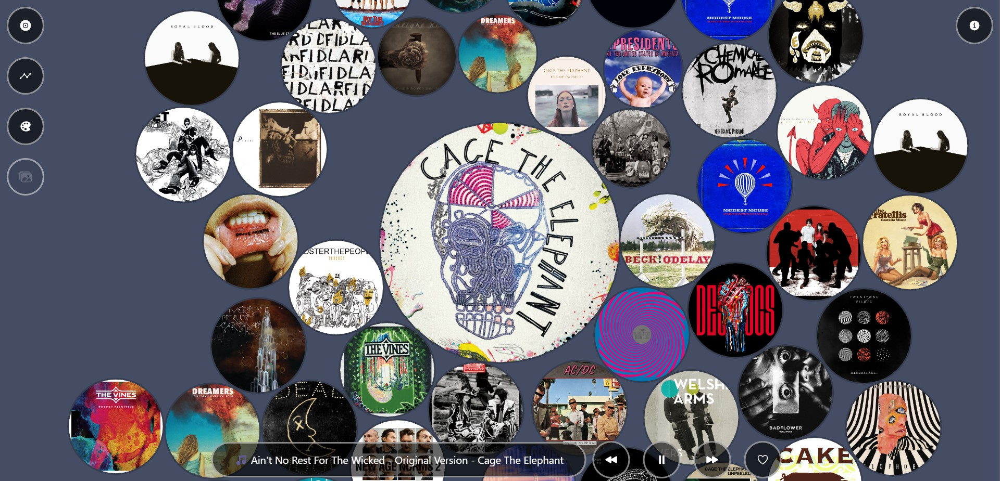
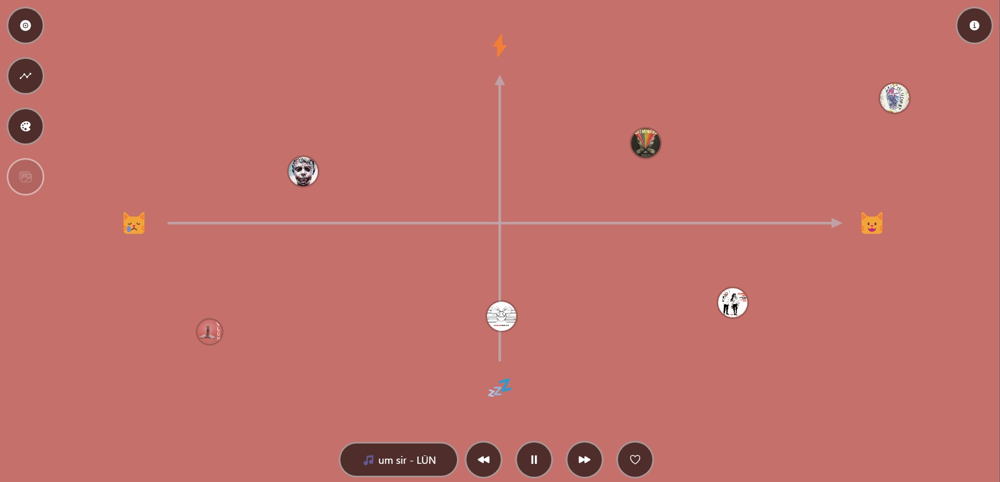
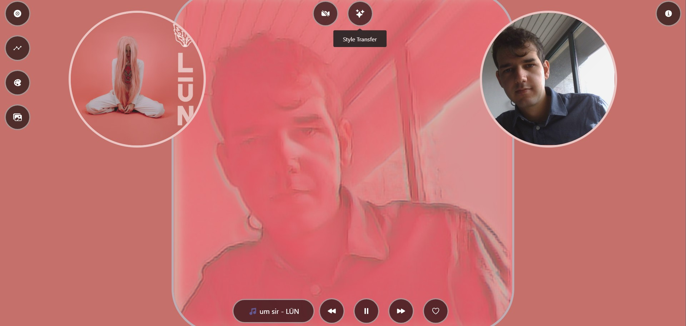
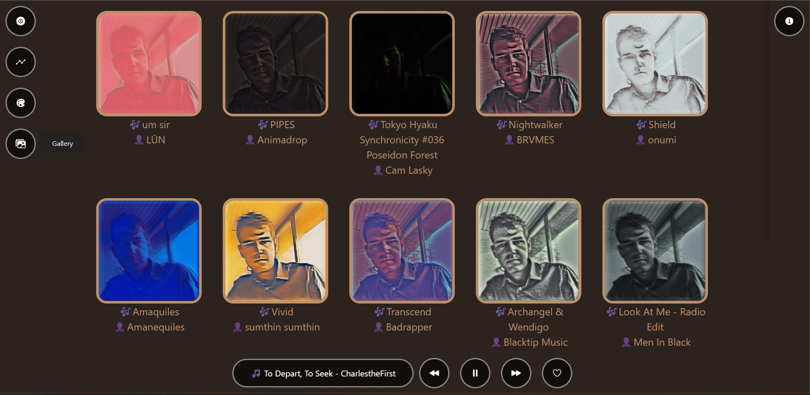

# Spotty Player 🫧

is a Spotify player, visualizer, and recommender. 🌌

You can watch the demo presentation [🎥 here](https://www.youtube.com/watch?v=2wZY_Xzv_So) but you can also try it yourself: [Spotty Player 🫧](https://spotty-player.herokuapp.com/)

_please notice that you will need a premium Spotify account and you need to be added to the access list. Please write me an e-mail at [✉️ maver.federico@gmail.com](maver.federico@gmail.com) specifying your name, surname, and your Spotify email._

Enjoy and have a great listening session! 🎶

## Login Page

At your first access, you'll be prompted to log in to your Spotify account. This process is managed by the [Spotify OAuth flow](https://developer.spotify.com/documentation/general/guides/authorization/code-flow/) so that we don't have access to your data. 🔒

## Info Page

The first screen that you'll encounter is the info page, where you can find a brief tutorial on how the app works. Click anywhere on the screen to continue to the dashboard.


## Dashboard

The dashboard contains all the tools that you'll need to use the app.

- on the top left, you can find the main menu where you can select the main view.
- on the top right, the info menu will display some useful information and provides a link to the [Info Page](#info-page)
- on the bottom, there's the player menu, with:
  - currently playing song title and artist
  - play/pause and skip buttons ⏯️
  - add to the library button 💟

### Globes

This is the main view of the app where you can find your currently playing song at the center and orbiting around it a series of songs suggested by the Spotify recommendation algorithm. The songs are pulled to the center of the screen but at the same time experience a drift caused by the energy of the current song.



Click on a song to start playback and to generate new recommendations.

_tip: hover with the mouse on a circle to display the title and artist information about that album_

### Mood Selector

Here you can find your listening history organized in a valence-arousal plane.

The valence of a musical piece is a high-level feature that can be described as "happiness 😸" vs "sadness 😿"; the arousal instead represents the "energy ⚡" vs "calm 💤" description of the song.



Click on any point on the screen to guide the recommendation to the selected valence-arousal point, based on the currently playing track.

### Style Transfer

Here you can "artify" yourself to the currently playing album cover. Activate your webcam and press the button to produce a stylized representation of your photo.



### Gallery

The gallery collects all your style transfers with the information about the track that generated it.



## Resources

The tools that we used for the project are collected here:

- React
- color-thief
- spotify-web-api-node
- p5.js
- style transfer model by [magenta](https://magenta.tensorflow.org/blog/2018/12/20/style-transfer-js/)

## How to contribute to Spotty Player:

- Clone the repository
- Install dependencies (repeat for server and client): `npm install`
- Create a Spotify app from the developer dashboard, set up the _redirect_uri_, and retrieve the _client_id_ and the _client_secret_.
- Add file `.env` in the root, containing:
  ```
  REDIRECT_URI=_redirect_uri_
  CLIENT_ID=_client_id_code_
  CLIENT_SECRET=_client_secret_code_
  PORT=_server_port_
  ```
- Modify the file `client/src/credentials.json` with your _client_id_ code and the _redirect_uri_
- Start the server: `npm start`
- Start the client: `cd client`, then `npm start`
